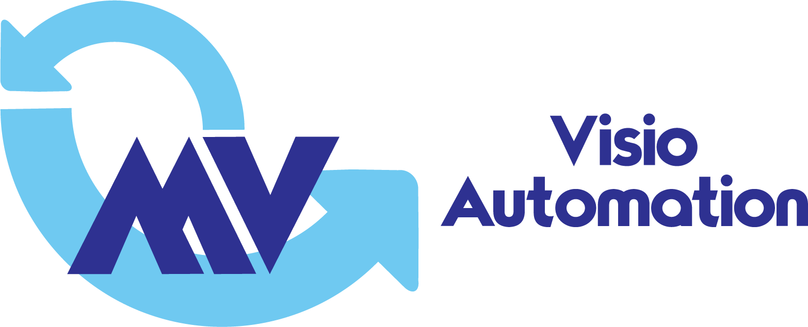

**VisioAutomation** makes it easier for developers to control Visio from .NET languages. In addition to simplifying common tasks, it makes it easier to build your own Visio add-ins and automation/scripting tools. 

Documentation here: https://saveenr.gitbooks.io/visioautomation_docs/

